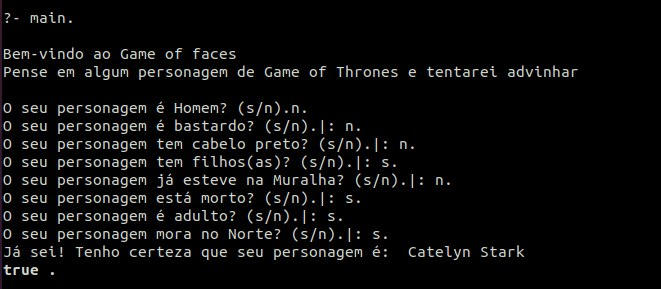
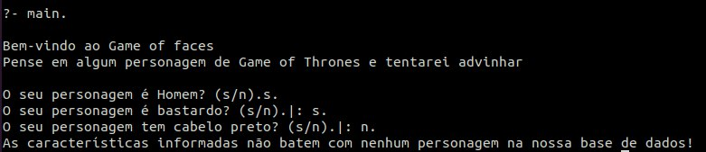

# Game of Faces

**Disciplina**: FGA0210 - PARADIGMAS DE PROGRAMAÇÃO - T02 <br>
**Nro do Grupo**: G5<br>
**Paradigma**: Lógico<br>

## Alunos

| Matrícula  | Aluno                                    |
| ---------- | ---------------------------------------- |
| 18/0011961 | Aline Helena Lermen                      |
| 17/0006328 | Ariel Vieira Lima Serafim                |
| 19/0056843 | Carlos Eduardo de Sousa Fiuza            |
| 17/0139981 | Danillo Gonçalves de Souza               |
| 17/0010341 | Gabriel Davi Silva Pereira               |
| 18/0122606 | Isadora da Cruz Galvão dos Santos Soares |
| 17/0069800 | Ithalo Luiz de Azevedo Mendes            |
| 17/0145514 | Iuri de Souza Severo Alves               |
| 17/0164411 | Victor Amaral Cerqueira                  |

## Sobre

O projeto _Game of Faces_ é um programa adivinho baseado no jogo Akinator e Cara a Cara. O código tem como missão adivinhar a personagem da famosa série de televisão _Game of Thrones_ que o úsuario está pensando. Para isso, foi utilizado a linguagem de programação _Prolog_.
A partir das respostas que o úsuario dá ao nosso programa, é possível identificar a personagem utilizando principios do paradigma lógico vistos em sala de aula.

## Screenshots

### Personagem encontrado na base



### Personagem não encontrado na base



## Instalação

**Linguagens**: Prolog<br>
**Tecnologias**: SWI-Prolog<br>

1- Instalar a ferramenta [SWI-Prolog](https://www.swi-prolog.org/download/stable). Seguindo o passo a passo para sua plataforma.

2- Faça um clone do reposítorio

3- No terminal, vá para a pasta raíz do projeto e execute o seguinte comando:

- Input

```
swipl main.pl popula.pl utils.pl
```

- Output

```
Welcome to SWI-Prolog (threaded, 64 bits, version 8.4.2)
SWI-Prolog comes with ABSOLUTELY NO WARRANTY. This is free software.
Please run ?- license. for legal details.

For online help and background, visit https://www.swi-prolog.org
For built-in help, use ?- help(Topic). or ?- apropos(Word).

```

4- Assim que os arquivos forem carregados para o _SWI-Prolog_, chame a função principal

```
?- main.
```

## Uso

Para usufruir do programa, deve-se executar todas as etapas a cima. Assim que o programa tiver sido executado basta responder as perguntas do teminal com `s.` para sim ou `n.` para não. Não existe mais nenhum caso de uso.

## Vídeo

Adicione 1 ou mais vídeos com a execução do projeto.

## Outros

- Embed de nosso prótotipo

<iframe style="border: 1px solid rgba(0, 0, 0, 0.1);" width="800" height="450" src="https://www.figma.com/embed?embed_host=share&url=https%3A%2F%2Fwww.figma.com%2Ffile%2FeEYsPcKrCMTnyyegUKhE6m%2FParadigmal%25C3%25B3gico%3Fnode-id%3D0%253A1" allowfullscreen></iframe>

## Fontes

### Back

- [Akinator of Thrones](https://github.com/Paradigmas-2-2017/akinator-of-thrones)

  - Projeto similar encontrado durante desenvolvimento

- [Documentação do Prolog](https://www.swi-prolog.org/pldoc/doc_for?object=manual)

### Front

- [Server Prolog](https://github.com/da-poodle/react-and-prolog-demo)
- [Pyswip ler e escrever Prolog](https://github.com/rla/node-swipl)
